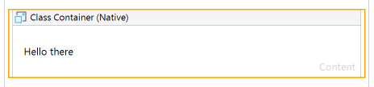
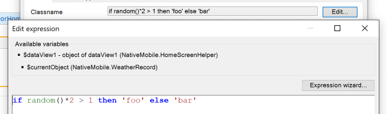

## ClassContainerNativeJS

An implementation of https://github.com/cdcharlebois/ww-class-container for Native

## Features

Renders a container with a dynamic class, so you don't have to include mutliple containers using conditional visibility

## Usage

Note, this widget currently requires you to expose your native styles on a global object, `mx.ui.__STYLES`. You can do this using a JS action like this:

```js
import * as Styles from "../../../theme/styles";

// ...

export async function ExposeStylesToClient() {
	// BEGIN USER CODE
  window.mx.ui.__STYLES = Styles;
	// END USER CODE
}
```






## Issues, suggestions and feature requests

https://github.com/cdcharlebois/ww-class-container/issues

## Development and contribution

Now accepting PRs

